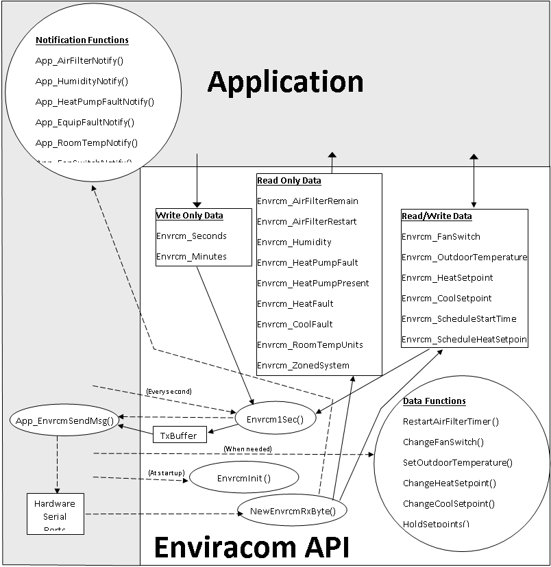

# Enviracom API

## Features

The Enviracom API handles most of the subtle nuances when interfacing to the T8635 thermostat through the Enviracom Serial Adapter, reducing the learning curve needed, and saving development time. It is compatible with multiple T8635 thermostats on a single Enviracom bus (zoning) and/or with multiple Enviracom busses (multiple furnaces). The API is written using the C language and is designed to link the API source code into the application software. The API implements the following features:

* Multiple Enviracom Serial Adapter support (multiple Enviracom busses)
* Automatic zoned or non-zoned system compatibility
* All Enviracom busses are synchronized to the application provided clock.
* 5 second transmit delay at startup
* Automatic querying of Enviracom data
* Automatically determines when Enviracom data is no longer present, either because periodic reporting stops or because no response received to query or change requests
* Application may read the following Enviracom data:
    * Setpoints
    * Setpoint limits and deadband
    * System switch
    * Allowed system switch positions
    * Fan switch
    * Schedules
    * Air filter timer
    * Heat pump fault
    * Heat/cool equipment fault
    * Zone manager existence
    * Room temperature
    * Outdoor temperature
* Application gets immediate notification when Enviracom data changes
* Applicaton may change the following Enviracom data:
    * Setpoints
    * System switch
    * Fan switch
    * Schedules
    * Restart air filter timer
* An outdoor temperature received from any Enviracom bus is automatically sent to all other Enviracom busses.
* The application may provide the outdoor temperature, which is automatically sent to all Enviracom busses.
 
 

 
 

## API Components

### Enviracom API Components

The Enviracom API supplies these components. For more details of these components, see the source file,  [`EnviracomAPI.h`](../enviracom/EnviracomAPI.h).

1.  Write Only Data

    Write only data is written by the application and read by the API to change the configuration of an Enviracom device. The data is used to create Enviracom messages sent by the Enviracom Serial Adapter. After writing to data, the application must usually call an associated Data Function to signal to the API that an Enviracom change message must be queued.

2. Read Only Data

    Read only data is read by the application and written by the API. It contains the current data of Enviracom devices from information received by the Enviracom Serial Adapter.

3. Read/Write Data

    Read/Write data may be read by the application to view the current data of Enviracom devices, or it may be written by the application in order to change the data of an Enviracom device. After writing to data, the application must usually call an associated Data Function to signal to the API that an Enviracom change message must be queued.

4. TxBuffer

    TxBuffer contains the messages that the application must send on the serial ports. TxBuffer contains at most one message per serial port. TxBuffer is written by `Envrcm1Sec()` and read by `App_EnvrcmSendMsg()`.

5. Data Functions

    Data functions may be called by the application, usually after writing to associated Read/Write or Write Only data, in order to change the configuration of an Enviracom device. Calling these functions is a signal to the API that an Enviracom change message must be queued. These functions must run in the same thread as `Envrcm1Sec()`.

6. `Envrcm1Sec()`

    `Envrcm1Sec` is an API function that must be called by the application at one-second intervals. This function performs all API timing, and sends the next queued message to the Enviracom Serial Adapter when the previous message completes.

7. `NewEnvrcmRxByte()`

    `NewEnvrcmRxByte` is an API function that must be called by the application for every serial byte received from the Enviracom Serial Adapter. It must run in the same thread as `Envrcm1Sec()`.

8. `EnvrcmInit()`
    `EnvrcmInit()` must be called by the application at startup before it calls any other API function or reads/writes any API variable. It initializes the Enviracom API.

 
 

### Application Components

The application must supply these components. For more details of these components, see the source file, [`EnviracomAPI.h`](../enviracom/EnviracomAPI.h).

1. Notification Functions

    The Enviracom API calls Notification Functions as a signal to the application that the associated Read Only or Read/Write data items have changed. There is no requirement that the application do anything during any of these function calls.

2. `App\EnvrcmSendMsg`

    `App\EnvrcmSendMsg` is an application supplied function that is called by the API when a message must be sent to the Enviracom Serial Adapter. The API will not call this function again until the Enviracom Serial Adapter has ACK'ed or NACK'ed the previous message or until a timeout period has expired, in which case the application can discard the previous message. This function is only responsible for setting up the message byte string to be sent to the Enviracom Serial Adapter in the background. This function must return immediately, that is, it cannot wait until the entire message has been sent to the Enviracom Serial Adapter before returning.

3. Hardware Serial Ports

    The hardware serial ports, the capability to write a string of data bytes to the serial ports, and the capability to receive each data byte from the serial ports are the responsibility of the application. The serial ports must be configured for 19.2K bits per second, 8 data bytes, no parity, 1 stop bit.

 

# Messaging Protocol

The Enviracom protocol is documented in [PROTOCOL.md](PROTOCOL.md)

 

# Source Files

The Enviracom API consists of the following source files:

## `EnviracomAPI.h`

The source file, [`EnviracomAPI.h`](../enviracom/EnviracomAPI.h), contains the data declarations, definitions, and function prototypes used by the Enviracom API. It is extensively commented and should be the primary reference for application developers needing to know the details. The section in the file titled 'Application Defined Constants' must be modified by application developers to configure the API to their application.

## `EnviracomAPI.c`

The source file, [`EnviracomAPI.c`](../enviracom/EnviracomAPI.c), contains all of the API's software. After compiling this file, the object module should be linked with application software.

## `EnviracomAPIApp.c`

The source file, [`EnviracomAPIApp.c`](../enviracom/EnviracomAPIApp.c), is a source file template for the Application Components. Application developers should add source code as needed to the various sections of this file.
